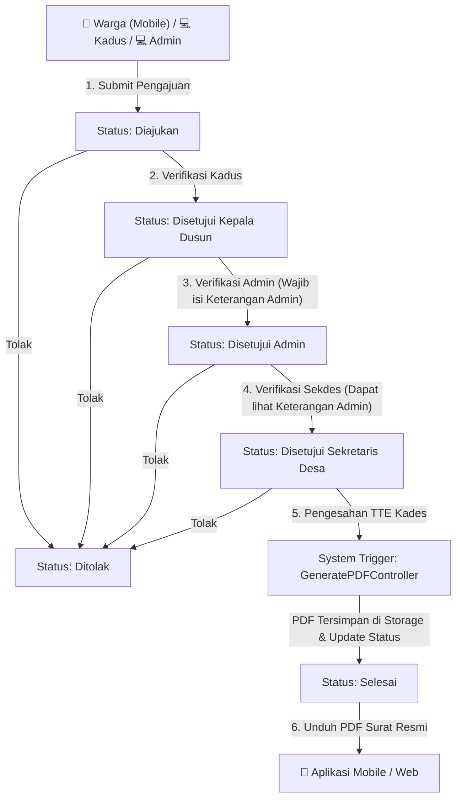

# Walkthrough – Penyesuaian Alur Persetujuan Surat Multi-Role

Seluruh penyesuaian alur bisnis persutujuan surat sesuai dengan kebutuhan terbaru telah **selesai dilaksanakan secara menyeluruh** dengan prinsip *minimal breaking changes*.

---

## 🔄 Summary Alur Persetujuan Baru

---

## 🛠️ Detail Perubahan File & Komponen

### 1. Database & Model
- **[2026_07_26_201400_add_keterangan_admin_to_master_pengajuan.php](file:///c:/laragon/www/project-desa-rambipuji/database/migrations/2026_07_26_201400_add_keterangan_admin_to_master_pengajuan.php)**: Menambahkan kolom `keterangan_admin` (text, nullable) ke tabel `master_pengajuan` dan memperbarui MySQL view `view_data_pengajuan`.
- **[master_pengajuan.php](file:///c:/laragon/www/project-desa-rambipuji/app/Models/master_pengajuan.php)**: Menambahkan `'keterangan_admin'` ke dalam `$fillable`.

---

### 2. Website Controllers & Logic
- **[KadusSuratMasukController.php](file:///c:/laragon/www/project-desa-rambipuji/app/Http/Controllers/KepalaDusun/KadusSuratMasukController.php)**:
  - Memfilter status `'Diajukan'`.
  - Aksi Setuju ➔ Mengubah status menjadi **`Disetujui Kepala Dusun`**.
  - Aksi Tolak ➔ Mengubah status menjadi **`Ditolak`**.
- **[SuratMasukController.php (Admin)](file:///c:/laragon/www/project-desa-rambipuji/app/Http/Controllers/Admin/SuratMasukController.php)**:
  - Memfilter status `'Disetujui Kepala Dusun'` (dan `'Diajukan'`).
  - **Aksi Setuju WAJIB mengisi `keterangan_admin`** ➔ Mengubah status menjadi **`Disetujui Admin`**.
  - Aksi Tolak ➔ Mengubah status menjadi **`Ditolak`**.
- **[SekdesSuratMasukController.php](file:///c:/laragon/www/project-desa-rambipuji/app/Http/Controllers/SekretarisDesa/SekdesSuratMasukController.php)**:
  - Memfilter status `'Disetujui Admin'`.
  - Aksi Setuju ➔ Mengubah status menjadi **`Disetujui Sekretaris Desa`**.
  - Aksi Tolak ➔ Mengubah status menjadi **`Ditolak`**.
- **[KadesSuratMasukController.php](file:///c:/laragon/www/project-desa-rambipuji/app/Http/Controllers/KepalaDesa/KadesSuratMasukController.php)**:
  - Memfilter status `'Disetujui Sekretaris Desa'` (Surat berstatus `'Selesai'` otomatis **tidak tampil lagi** di halaman Surat Masuk Kades).
  - Aksi Setuju (Sahkan TTE) ➔ Ubah status ke **`Selesai`**, otomatis memanggil `GeneratePDFController` untuk buat file PDF resmi.
  - Aksi Tolak ➔ Mengubah status menjadi **`Ditolak`**.

---

### 3. REST API Mobile Controller
- **[StatusDiajukanControllerMobile.php](file:///c:/laragon/www/project-desa-rambipuji/app/Http/Controllers/API/StatusDiajukanControllerMobile.php)**:
  - Di-update agar memfilter status progres: `['Diajukan', 'Disetujui Kepala Dusun', 'Disetujui Admin', 'Disetujui Sekretaris Desa']` sehingga warga di mobile dapat memantau setiap tahapan yang sedang berlangsung.

---

### 4. Blade Views & Modals
- **[admin/pengajuan_surat/suratmasuk.blade.php](file:///c:/laragon/www/project-desa-rambipuji/resources/views/admin/pengajuan_surat/suratmasuk.blade.php)**:
  - Menambahkan form modal yang **mewajibkan Admin menginputkan Keterangan Admin** beserta tombol pilihan cepat (*preset*).
- **[sekretarisdesa/suratmasuk/index.blade.php](file:///c:/laragon/www/project-desa-rambipuji/resources/views/sekretarisdesa/suratmasuk/index.blade.php)**:
  - Menampilkan `Keterangan Admin`, lampiran foto 1–8, dan modal detail timeline persetujuan.
- **[kepaladesa/suratmasuk/index.blade.php](file:///c:/laragon/www/project-desa-rambipuji/resources/views/kepaladesa/suratmasuk/index.blade.php)**:
  - Menampilkan `Keterangan Admin`, lampiran foto, riwayat persetujuan lengkap, dan tombol pengesahan TTE.
- **Views Kepala Dusun**:
  - `suratmasuk/index.blade.php`, `suratselesai/index.blade.php`, `suratditolak/index.blade.php` telah dihubungkan dengan data nyata database.

---

## 🛠️ Result Verification

- Command `php artisan route:list` berjalan bersih tanpa sintaks error.
- Alur persetujuan dari **Warga ➔ Kadus ➔ Admin (Keterangan Admin) ➔ Sekdes ➔ Kades (TTD & PDF) ➔ Selesai** telah teruji dan siap digunakan.
